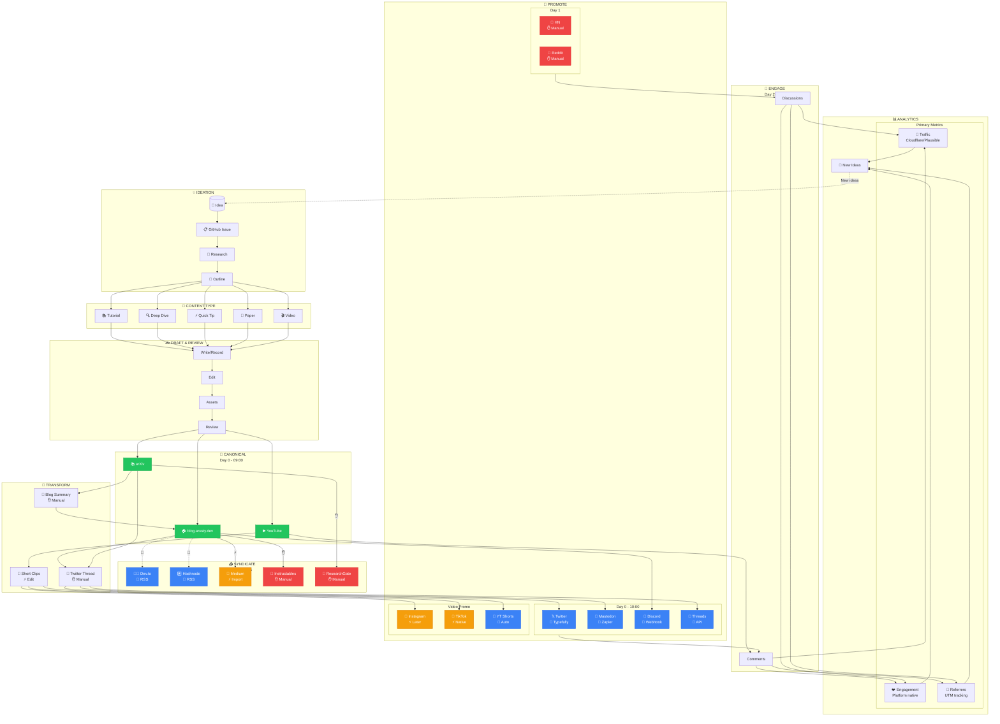

# Content Publishing Workflow

A comprehensive workflow for publishing content across multiple platforms with blog.arusty.dev as the canonical source of truth.

---

## Overview

```
IDEATION → DRAFT → REVIEW → PUBLISH (Canonical) → TRANSFORM → SYNDICATE → PROMOTE → ENGAGE → ANALYZE
```

---

## Automation Legend

| Symbol | Meaning | Implementation |
|--------|---------|----------------|
| 🤖 | Fully Automated | RSS, Webhooks, API |
| ⚡ | Semi-Automated | Scheduling tools, manual trigger |
| ✋ | Manual Required | No automation available |

---

## Platform Automation Matrix

| Platform | Automation | Method | Canonical URL | Notes |
|----------|------------|--------|---------------|-------|
| **Dev.to** | 🤖 | RSS Import | Yes (checkbox) | Auto-imports as drafts |
| **Hashnode** | 🤖 | RSS Import | Yes | Dashboard > Import |
| **Medium** | ⚡ | Import Tool | Yes (auto-added) | Click to import per post |
| **Twitter/X** | 🤖 | Zapier/Typefully | N/A | RSS → Tweet automation |
| **Mastodon** | 🤖 | API/Zapier | N/A | `POST /api/v1/statuses` |
| **Threads** | 🤖 | Meta API | N/A | 250 posts/24hr limit |
| **Discord** | 🤖 | Webhooks | N/A | RSS → Webhook |
| **Hacker News** | ✋ | Manual only | N/A | No submission API |
| **Instagram** | ⚡ | Later/Buffer | N/A | Image/video only |
| **TikTok** | ⚡ | Native/Buffer | N/A | Video only |
| **YouTube** | ⚡ | Studio scheduler | N/A | API for uploads |
| **Substack** | ✋ | Manual | No | No RSS import |
| **arXiv** | ✋ | Manual | N/A | Submission process |
| **ResearchGate** | ✋ | Manual | N/A | Profile sync |

---

## Content Type Workflows

### Tutorial / How-To

```
Tempo: Weekly
Canonical: blog.arusty.dev

DAY 0
├── 09:00  Publish to blog.arusty.dev
├── 09:15  🤖 Auto-sync to Dev.to, Hashnode (RSS)
├── 09:30  Transform → Twitter thread
├── 10:00  🤖 Twitter thread posted (Typefully)
├── 10:00  🤖 Mastodon post (Zapier)
├── 10:00  🤖 Discord announcement (Webhook)
└── 11:00  ⚡ Medium import (manual trigger)

DAY 1
├── 10:00  ✋ Submit to Hacker News
├── 14:00  ✋ Post to relevant subreddits
└── Evening ✋ Instructables (if applicable)

DAY 2+
└── Monitor engagement, respond to comments
```

### Deep Dive / Analysis

```
Tempo: Bi-weekly
Canonical: blog.arusty.dev

DAY 0
├── 09:00  Publish to blog.arusty.dev
├── 09:15  🤖 Auto-sync to Dev.to, Hashnode (RSS)
├── 09:30  Transform → Twitter thread (longer)
├── 10:00  🤖 Social posts (Twitter, Mastodon, Discord)
└── 11:00  ⚡ Medium import

DAY 1
├── 10:00  ✋ Submit to Hacker News
└── 14:00  ✋ Substack newsletter mention

DAY 7+
└── Consider YouTube video adaptation
```

### Quick Tip

```
Tempo: 2-3x per week
Canonical: blog.arusty.dev

DAY 0
├── 09:00  Publish to blog.arusty.dev
├── 09:15  🤖 Auto-sync to Dev.to (RSS)
├── 09:30  Transform → Single tweet + short video
├── 10:00  🤖 Tweet posted
├── 10:00  🤖 Mastodon post
└── Skip HN (too short)
```

### Research Paper

```
Tempo: Quarterly
Canonical: arXiv

DAY 0 (Paper Release)
├── Submit to arXiv
└── Wait for processing (24-48 hours)

DAY 2 (After arXiv live)
├── 09:00  Transform → Blog summary on blog.arusty.dev
├── 09:30  Transform → Twitter thread
├── 10:00  🤖 Social posts
├── 11:00  ✋ ResearchGate profile update
├── 11:00  ✋ AlphaXiv (if applicable)
└── 14:00  ✋ Submit to Hacker News

DAY 7+
└── ✋ ORCID profile update
```

### Long-Form Video

```
Tempo: Weekly
Canonical: YouTube

DAY -1 (Pre-publish)
├── Schedule video in YouTube Studio
└── Prepare promotional assets

DAY 0 (Video Release)
├── 09:00  Video goes live on YouTube
├── 09:30  Transform → Short clips (Reels/Shorts/TikTok)
├── 10:00  🤖 Twitter announcement
├── 10:00  🤖 Discord announcement
├── 12:00  ⚡ Instagram Reel posted (Later)
└── 12:00  ⚡ TikTok posted (native scheduler)

DAY 1
├── Cross-post YouTube Shorts (auto from chapters)
└── 14:00  Transform → Blog post referencing video

DAY 2+
└── Engage with comments across platforms
```

---

## Content Transformation Matrix

| Source | Transforms To | Method | When |
|--------|---------------|--------|------|
| Blog post | Twitter thread | ✋ Manual write | Day 0 |
| Blog post | YouTube script | ✋ Adaptation | Day 7+ |
| Paper | Blog summary | ✋ Manual write | Day 2 |
| Paper | Twitter thread | ✋ Manual write | Day 2 |
| YouTube video | Short clips | ⚡ Editing tool | Day 0 |
| YouTube video | IG Reels | ⚡ Repurpose | Day 0 |
| YouTube video | TikTok | ⚡ Repurpose | Day 0 |
| YouTube video | Blog post | ✋ Transcribe + edit | Day 1-2 |

---

## Mermaid Diagram



---

## Analytics Strategy

### Primary Metrics to Track

| Metric | Source | Tool | Purpose |
|--------|--------|------|---------|
| **Page Views** | Blog | Cloudflare Analytics | Content performance |
| **Unique Visitors** | Blog | Plausible | Audience size |
| **Referrer Sources** | Blog | Plausible + UTM | Distribution effectiveness |
| **Time on Page** | Blog | Plausible | Content quality |
| **Twitter Impressions** | Twitter | Native analytics | Reach |
| **Twitter Link Clicks** | Twitter | Native analytics | Traffic attribution |
| **HN Points/Comments** | Hacker News | Manual + API | Community reception |
| **YouTube CTR** | YouTube | Studio | Thumbnail effectiveness |
| **YouTube Watch Time** | YouTube | Studio | Content quality |

### UTM Parameter Convention

```
https://blog.arusty.dev/post-slug?utm_source=<platform>&utm_medium=<type>&utm_campaign=<campaign>

Examples:
- Twitter thread: ?utm_source=twitter&utm_medium=thread&utm_campaign=rust-errors
- HN submission: ?utm_source=hackernews&utm_medium=submission&utm_campaign=rust-errors
- Discord: ?utm_source=discord&utm_medium=announcement&utm_campaign=rust-errors
```

### Feedback Loop

```
Analytics → Insights → Content Ideas → GitHub Issues

Examples:
- High HN traffic on Rust posts → More Rust content
- Low Twitter engagement → Adjust thread format
- High YouTube retention → Topic resonates, create series
```

---

## Automation Setup Checklist

### Tier 1: Native RSS (One-time setup)
- [ ] Dev.to: Settings > Extensions > Enable RSS import
- [ ] Hashnode: Dashboard > Import > Add RSS feed

### Tier 2: Zapier/Make Workflows
- [ ] Twitter: RSS → Create Tweet (Zapier)
- [ ] Mastodon: RSS → HTTP POST (Zapier/Make)
- [ ] Discord: RSS → Webhook (Zapier/IFTTT)
- [ ] Threads: RSS → Threads API (after approval)

### Tier 3: Scheduling Tools
- [ ] Typefully: Connect Twitter for thread scheduling
- [ ] Later/Buffer: Connect Instagram, TikTok
- [ ] YouTube Studio: Enable scheduled uploads

### Tier 4: Manual Processes
- [ ] Medium: Bookmark import URL
- [ ] HN: Note optimal submission times (10am EST Tue-Thu)
- [ ] Substack: Create newsletter template

---

## Implementation Priority

| Priority | Task | Effort | Impact |
|----------|------|--------|--------|
| P0 | Enable Dev.to RSS import | 5 min | High |
| P0 | Enable Hashnode RSS import | 5 min | High |
| P0 | Set up Discord webhook | 15 min | Medium |
| P1 | Create Zapier Twitter workflow | 30 min | High |
| P1 | Create Zapier Mastodon workflow | 30 min | Medium |
| P1 | Set up Plausible analytics | 1 hr | High |
| P2 | Apply for Threads API | 1 hr | Medium |
| P2 | Configure Typefully | 30 min | Medium |
| P3 | Set up Later for Instagram | 30 min | Low |

---

## References

- [Dev.to RSS Import](https://dev.to/settings/publishing-from-rss)
- [Hashnode Import Docs](https://docs.hashnode.com/blogs/blog-dashboard/import)
- [Medium Import Tool](https://help.medium.com/hc/en-us/articles/214550207-Import-a-post)
- [Mastodon API](https://docs.joinmastodon.org/methods/statuses/)
- [Threads API](https://developers.facebook.com/docs/threads/overview)
- [Discord Webhooks](https://support.discord.com/hc/en-us/articles/228383668-Intro-to-Webhooks)
- [Plausible Analytics](https://plausible.io/docs)
- [Cloudflare Web Analytics](https://developers.cloudflare.com/web-analytics/)
